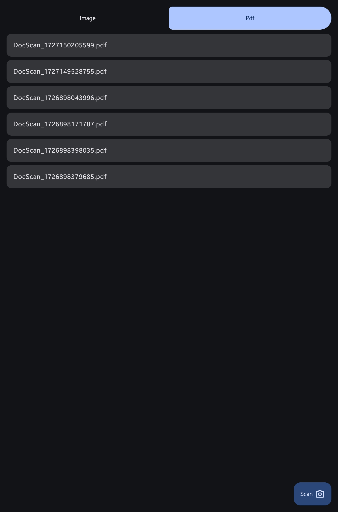

# 📄 Doc Scanner: AI-Powered Document Scanning & PDF Creation

**Doc Scanner** is an Android app that leverages the advanced capabilities of Google ML Kit to bring effortless document scanning right to your fingertips! Whether you need to save documents as high-quality images or PDFs, this app has got you covered.

## ✨ Features
 - **🤖 AI-Powered Document Scanning:**
   - Effortlessly capture and enhance your documents using Google ML Kit’s cutting-edge technology.
 - **🖼️ Save as Image or PDF:**
   - Choose to save your scanned documents as crisp images or shareable PDF files.
 - **🔒 Seamless Permission Handling:**
   - Advanced permission management for Android 10 and above, with backward compatibility for Android 9 and below.
 - **📂 Smart Storage Management:**
   - Save your documents securely and conveniently across different Android versions.

## 🧩 Tech Stack
- Google ML Kit: For advanced document scanning and processing.
- Android Jetpack Components: Modern Android components for robust app architecture.
- Kotlin: The primary language used for a concise and efficient codebase.

## Tech stack
- **Kotlin**: The primary language used for a concise and efficient codebase.
- **Jetpack Compose**: Modern UI toolkit for building native Android interfaces with a declarative approach.
- **Google ML Kit**: Advanced machine learning capabilities for document scanning.
- **Koin**: Dependency injection framework for Kotlin.
- **KSP (Kotlin Symbol Processing)**: For generating code, such as Koin module configuration.
- **Android Jetpack Libraries**: Core libraries for robust architecture and smooth user experience.
- **Material3**: For implementing Material Design 3 components.
- **Coil**: Image loading library optimized for Android.

## 🛠️ Installation
- Clone the Repository
- Open the project in Android Studio
- Ensure all dependencies are installed and up-to-date
- Connect your Android device or start an emulator, then build and run the project

## 📧 Contact
If you have any questions, feel free to reach out!
- Email: frank.jr.619@gmail.com
- GitHub: [@fjr619](https://github.com/fjr619)
- LinkedIn [franky-wijanarko](https://id.linkedin.com/in/franky-wijanarko)

## Screenshoot
<table>
  <tr>
    <th>Home Img List</th>
    <th>Home Pdf List</th>
    <th>Scanner For Img</th>
        <th>Scanner for Pdf</th>
  </tr>
  <tr>
    <td></td>
    <td></td>
    <td></td>
    <td></td>
  </tr>
</table>

## DEMO APP
https://github.com/user-attachments/assets/11b70667-dc5b-466d-8e66-6b24a264ed25

## STORAGE LOCATION
https://github.com/user-attachments/assets/e2905c6d-c3e0-413b-9968-50a6583450c0
